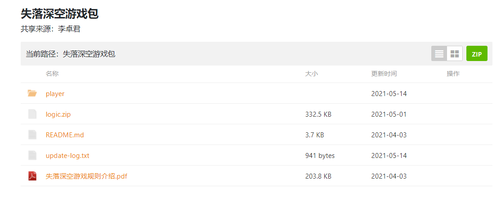
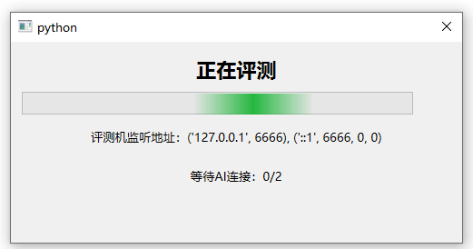
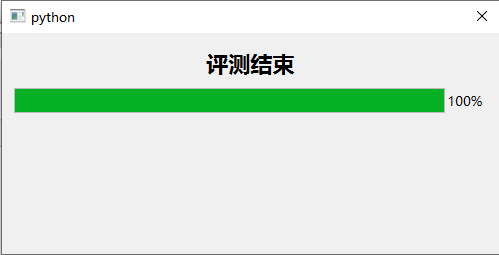
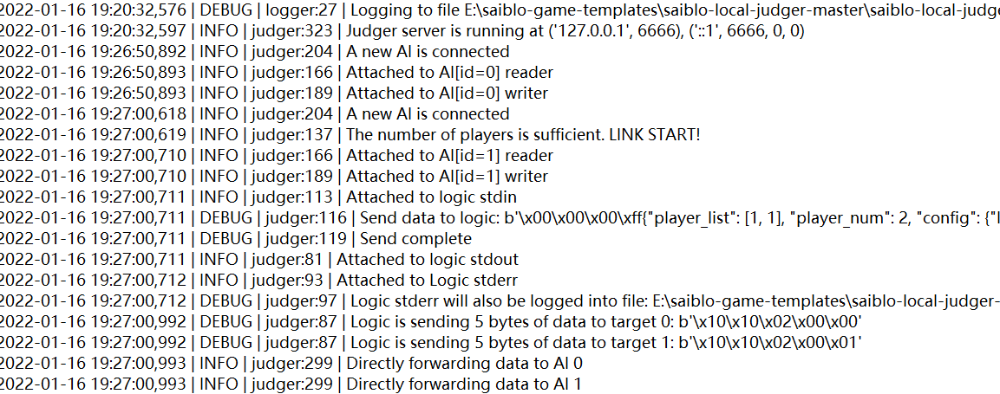

# AI 编写手册

## 下载游戏包

在开始编写你的AI之前，请先前往游戏页面下载游戏包，具体步骤可见用户手册-进入游戏一节。以失落深空游戏为例，游戏包中会包括不限于如下内容：

- 游戏包更新说明
- 游戏规则文档
- 游戏逻辑代码包
- ADK及其说明文档
- 本地调试工具



## 使用ADK进行AI的编写

对于刚上手的AI编写者，请先在阅读并理解游戏规则的基础上，进一步阅读对应语言所提供的的ADK说明文档及其他相关文档，这些文档会位于游戏包中。以SnakeGo游戏为例


游戏包中，`ai`文件夹下会包含Python及C++的ADK以及示例AI代码；`docs`文件夹下会包含若干份详细的使用指导，包括ADK的使用说明，通讯协议以及回放文件的格式说明，这些文档也可于游戏手册中查看。请仔细阅读它们中的内容，这对你如何高效地利用ADK实现你自己的AI有着很大的帮助。使用指导可能会包含以下内容：

- AI编写的核心工作，需要完成哪些内容的编写
- 示例AI的基本思路及参考修改方向，你可以依托它来完成你的AI
- ADK所提供给选手的信息，如游戏局面信息等的利用方法

具体请阅读相应游戏的ADK使用引导，以及样例AI中的注释说明，如有任何问题请联系相关人员解答。

实际根据游戏的不同可能会存在其他使用指导，如在线播放器的回放文件格式说明，也请选手进行查看。

在完成AI的编写后，可以通过上传至Saiblo网站进行评测，可参见用户手册-上传AI一节。

## 在线评测输出调试信息

在Saiblo平台上进行对局的评测时，你不仅可以通过播放器、回放文件来查看游戏运行时的状况，平台也提供了查看选手AI调试输出信息的功能。

AI需要通过`stderr`标准错误流来输出自己的调试信息，具体操作方式如下：

`Python`

```python
sys.stderr.write(msg)
```

`C++`

```c++
std::cerr << msg;
```

关于`stderr`流的其他信息可以自行查阅相关资料，你可以通过在这里输出回合、操作、场面等有助于你修改AI的信息。

AI添加完调试输出语句后，进行在线评测，在对局页面右侧、AI版本边上有一个紫色的按钮，点击它可以看到你的AI输出的调试信息。


你可以在窗口中查看调试信息，也可以点击右上角的复制调试信息按钮，复制至文本编辑器中查看。

**注意！你的AI输出的调试信息不应过多，若输出信息总长度达到系统缓冲区上限，有可能会因为缓冲区被填满，导致你的 AI 被阻塞，而输掉比赛。**

## 本地调试工具使用说明

由于在线评测存在一些弊端，我们在部分游戏中会提供本地调试工具，便于选手进行更全面的调试。调试器会模拟网站上评测机的通信过程，能够在log中输出通信中传输的所有信息，可以方便选手查看自己的AI发送了什么、接收到了什么，也可在自己的AI中进行调试的输出。

在使用本工具前，你可能需要了解AI与逻辑、评测机之间的交互协议，可参见AI与逻辑的通信协议文档以及游戏开发者手册中逻辑与评测机的部分。

### 启动调试工具

本地调试工具会打包在游戏包中，解压后请打开`launcher.exe`文件来启动本地调试工具，图形界面如下：


以下是对界面上信息的解释：

- 玩家人数：游戏所需AI个数，可根据游戏的具体情况进行设置
- 监听端口：本调试工具基于TCP Socket提供本地AI连接与游戏运行支持，在运行时需要指定监听端口号，可指定也可随机生成
- 逻辑启动脚本路径：游戏包的逻辑代码也会提供一个类似于`run_logic.sh`的逻辑运行脚本或者使用Pyinstaller生成的可执行文件，点开右侧省略号选择该运行脚本即可
- 输出目录：评测机日志、回访文件等生成的文件路径，默认位于当前运行文件夹下
- 对局配置文件路径：需指定一个类型为`json`的对局配置文件，包含该对局的初始配置信息，不填则为默认配置信息

### 进行评测

在填好以上信息后，评测机进入监听环节，界面如下：



此时，需要选手将自己的AI与评测机进行连接，以SnakeGo游戏为例，Python及C++的ADK均提供了与评测机进行交互的功能，只需在运行时指定特殊的运行参数即可：

- C++ :  `./main host port` ，`host`为一个字符串，为主机地址；`port`为一个整数，为端口号
- Python : `python3 main.py host port`，同C++的参数

每个游戏提供的ADK实现方式可能不一样，请留意相关声明。

当玩家人数到达游戏配置后，评测即刻开始。

### 评测结束

评测结束后会有弹窗提醒，可查看对应文件夹下的评测信息。




以SnakeGo游戏为例，评测结束后的信息包括以下三个文件：


`judger.log`为评测机的输出日志，其中包含所有评测机接受或发出的信息



`logic_stderr.txt`中则包含逻辑通过`stderr`流输出的内容，包括调试信息、报错信息等

`replay.json`为游戏的回放文件，具体格式可参见对应游戏的回放文件说明